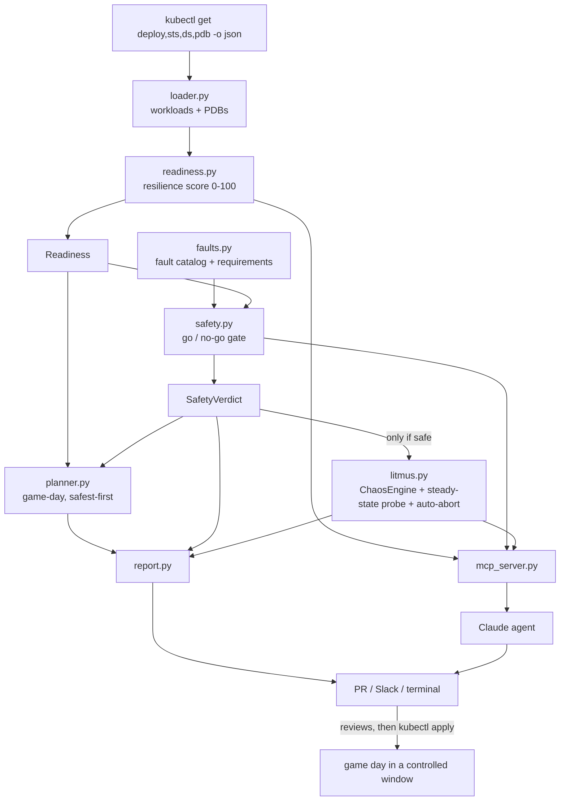

# Architecture

Layered so the **safety logic** is pure and testable and the **agent surface**
(skill / MCP) is a thin adapter. The engine scores, gates, and generates — it
never injects a fault.

## Why this shape

**Prove, then break.** `readiness` runs first and feeds `safety`; a fault is only
gated open where the score supports it. The engine will refuse to emit a manifest
for an experiment that would just cause an outage.

**Safety is pure and tested.** `readiness`, `faults`, `safety`, and `planner` have
zero dependency on `mcp` or a live cluster. The decision that matters — is this
experiment safe — is deterministic and unit-tested against a mixed fleet.

**The manifest carries its own brakes.** `litmus` always embeds a continuous
steady-state probe with `stopOnFailure`, so an experiment that violates its
hypothesis aborts itself. Safety isn't a runbook step you might forget; it's in
the generated artifact.

**The plan is also a backlog.** Blocked faults come with the exact remediation, so
a fragile workload's chaos plan reads as its hardening to-do list — turning a
"can't test this yet" into "here's how to make it testable."
